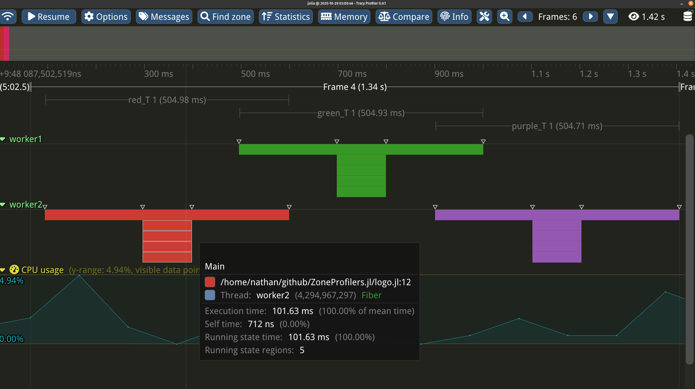
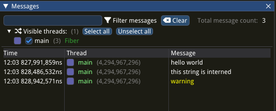
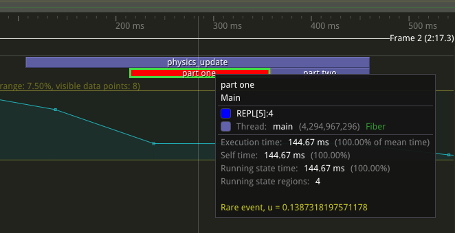
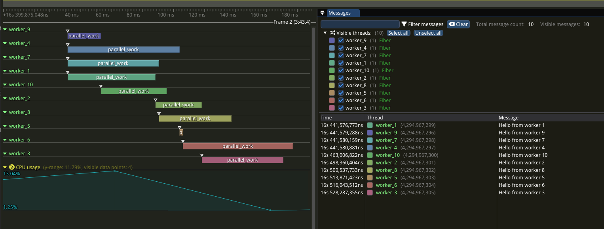
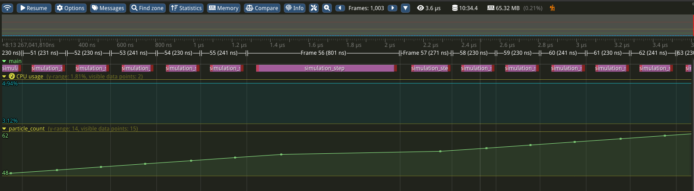

# ZoneProfilers.jl (WIP)

A Julia interface for the Tracy instrumentation-based profiler, designed for multithreaded simulations.



## Overview

ZoneProfilers provides utilities to markup code for logging and timing.

ZoneProfilerTracy provides a wrapper of [the Tracy C library v0.9.1](https://github.com/wolfpld/tracy/releases/tag/v0.9.1) for profiling marked up code.

ZoneProfilers uses an explicit profiler parameter to be passed through your call chain:

```julia
# ZoneProfilers approach - explicit profiler parameter
using ZoneProfilers
function simulate_physics(; profiler=NullProfiler())
    @zone profiler name="physics" begin
        # simulation code
        sleep(0.01)
    end
end

function run_simulation(; profiler=NullProfiler())
    @zone profiler name="simulation" begin
        for step in 1:10
            simulate_physics(; profiler)  # Pass profiler down
        end
    end
end

# Production: zero runtime overhead due to specialization
run_simulation()  # Uses NullProfiler(), compiled away

# Development: full profiling
import TracyProfiler_jll
run(TracyProfiler_jll.tracy(); wait=false) # Launch the profiler GUI

using ZoneProfilerTracy: TracyProfiler
profiler=TracyProfiler()
# Wait for Tracy viewer connection for up to 100 seconds
wait_for_connection(profiler; deadline= 100*10^9 + time_ns())

run_simulation(;profiler)  # Full instrumentation
```

## API Reference

### Profiler Management
- `wait_for_connection(profiler)` - Wait for the profiler recorder to be connected
- `is_connected(profiler)` - Check if the recorder is connected
- `app_info!(profiler, text)` - Write the trace description
- `new_stack(profiler, name) -> new_profiler` - Create a new zone stack

### Messaging
- `message!(profiler, text; [color])` - Log standalone message

### Zone Management
- `@zone profiler [name=, color=, active=] expression` - Profile an expression
- `@zone_begin profiler [name=, color=, active=]` - Start a profiling zone
- `zone_end!(profiler)` - End current zone
- `zone_active(profiler)` - Check if current zone is active

### Zone Modification
- `zone_color!(profiler, color)` - Set zone color at runtime
- `zone_text!(profiler, text)` - Add a line of text to current zone

### Frame Marking
- `frame_mark!(profiler, [name])` - Mark frame boundary
- `frame_mark_begin!(profiler, name)` - Start named frame
- `frame_mark_end!(profiler, name)` - End named frame

### Plotting
- `plot!(profiler, name, value)` - Add data point to plot

## Important limitations

Every instance of string or symbol data passed to the profiler can't be longer than 64 KB.

`Symbol`s passed to the profiler are required to have stable pointers for the rest of the lifetime of the process. Currently in Julia `Symbol`s are not garbage collected, but this might change in a future version of the language. To be future proof you must ensure there is a global reference to a symbol before passing it to a profiler.

The name passed to the `@zone` macros is limited to 511 bytes.
Source file path lengths are limited to 2047 bytes.

Due to the missmatch between how multithreading works in Julia vs C++, currently the GUI display of context switches are not accurate.
The "Draw context switches" option should be disabled in the Tracy GUI.

Currently there is no support for callstack logging. Help on supporting this would be greatly appreciated.

A connected tracy server can read arbitrary memory in the profiled process, so only use ZoneProfilerTracy in trusted environments.

Tracy is not supported on 32-bit systems.

## Core Concepts

### Messages

```julia
message!(profiler, "hello world")
message!(profiler, Symbol("this string is interned"))
message!(profiler, "warning"; color=:yellow)
```



### Zones

Zones represent a block of code you want to profile:

```julia
@zone profiler name="physics_update" color=:blue begin
    # physics_update
    sleep(0.1)
end
```

Zones can be nested to form a stack:

```julia
@zone profiler name="physics_update" color=:blue begin
    # physics_update
    sleep(0.1)
    @zone profiler name="part one" begin
        sleep(0.1)
    end
    @zone profiler name="part two" begin
        sleep(0.1)
    end
end
```

When using the `@zone` macro `name` and `color` must be literals.
Use `zone_color!` to set the color of a zone at runtime.
Use `zone_text!` to append a line of text to the zone annotation.

```julia
@zone profiler name="physics_update" begin
    # physics_update
    sleep(0.1)
    @zone profiler name="part one" color=0x0000FF begin
        u = rand()
        if u < 0.5
            # make the zone red and note the value of `u`
            zone_color!(profiler, 0xFF0000)
            # Gaurd with `zone_active(profiler) &&` to avoid constructing the string when not profiling.
            zone_active(profiler) && zone_text!(profiler, "Rare event, u = $(u)")
        end
        sleep(0.1)
    end
    @zone profiler name="part two" begin
        sleep(0.1)
    end
end
```



### Multiple Zone Stacks

ZoneProfilers supports task-local zone stacks.

A profiler with a new zone stack can be made using `new_stack`.

Asynchronous tasks that create or modify zones or send messages should do so to a local
zone stack. Zone stack names can be reused if the previous zone stack with that name is empty.

Multiple tasks should not concurrently share a zone stack.

```julia
# Each task gets its own profiling context
Threads.@threads for i in 1:10
    local task_profiler = new_stack(profiler, ()->Symbol("worker_$i"))
    @zone task_profiler name="parallel_work" begin
        if zone_active(task_profiler)
            message!(task_profiler, "Hello from worker $(i)")
        end
        # task-specific work
        sleep(rand()*0.1)
        # task local information
        zone_text!(task_profiler, "Chunk")
        zone_value!(task_profiler, UInt64(i))
    end
end
```



### Frame marks and Plots

Track key simulation metrics over time:

```julia
# Monitor performance metrics
particles = Float64[]
for step in 1:1000
    @zone profiler name="simulation_step" begin
        # Your simulation code
        # advance_simulation!(system, dt)
        push!(particles, rand())

        # Track metrics over time
        plot!(profiler, :particle_count, Float64(length(particles)))
    end
    
    frame_mark!(profiler) # mark the end of a step and the begining of the next step.
end
```



Frame marking and plotting are safe to do concurrently to a shared profiler.

### Conditional Profiling

Enable profiling only when needed to minimize overhead:

```julia
const PROFILING_ENABLED = false

# Profile only when explicitly enabled
@zone profiler active=PROFILING_ENABLED name="expensive_computation" begin
    # expensive_computation()
end

# Or use dynamic conditions, for example only profile on Monday
using Dates
should_profile() = Dates.dayofweek(Dates.now()) == Dates.Monday

@zone profiler active=should_profile name="expensive_computation" begin
    # expensive_computation()
end
```

The expression in the zone is run if the profiling is active or not.
The function passed to `active` will not be evaluated if the profiler is a `NullProfiler` for even less overhead.

## See Also

- [Tracy user manual](https://github.com/wolfpld/tracy/releases/download/v0.9.1/tracy.pdf) - The underlying profiling engine and GUI.
- [Tracy.jl](https://github.com/topolarity/Tracy.jl) - An alternative interface for tracy.
- [TimerOutputs.jl](https://github.com/KristofferC/TimerOutputs.jl) - Simple timing of sections of code.
- [TrackingTimers.jl](https://github.com/ericphanson/TrackingTimers.jl) - Timing of sections of code in the presence of parallelism.
- [Extrae.jl](https://github.com/bsc-quantic/Extrae.jl) - Julia bindings to BSC's extrae HPC profiler.
- [IntelITT.jl](https://github.com/JuliaPerf/IntelITT.jl) - Instrumentation for the proprietary Intel VTune profiler.
- [NVTX.jl](https://github.com/JuliaGPU/NVTX.jl) - Instrumentation for the proprietary Nsight systems profiler.
- [Statistical profiling in Julia](https://docs.julialang.org/en/v1.12/manual/profile/#Profiling)
- [Profiling the Julia runtime with Tracy](https://docs.julialang.org/en/v1.12/devdocs/external_profilers/#External-Profiler-Support)
- [Viewing Tracy files in your browser](https://docs.julialang.org/en/v1.12/devdocs/external_profilers/#Viewing-Tracy-files-in-your-browser)
